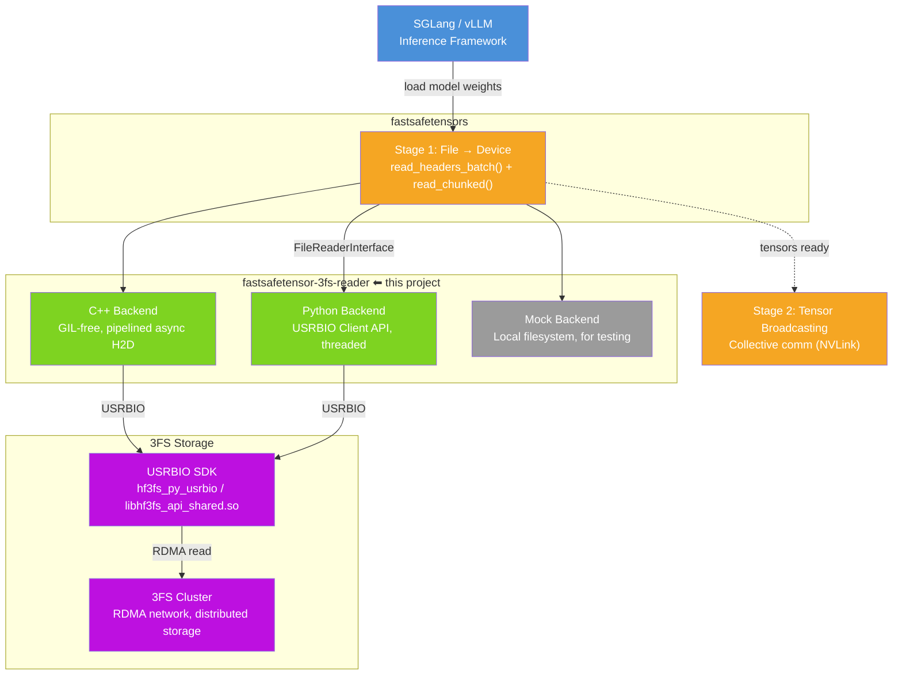
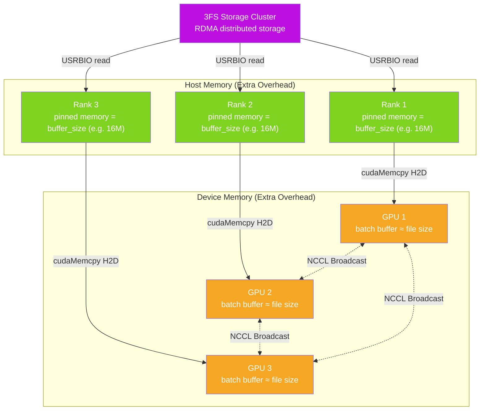
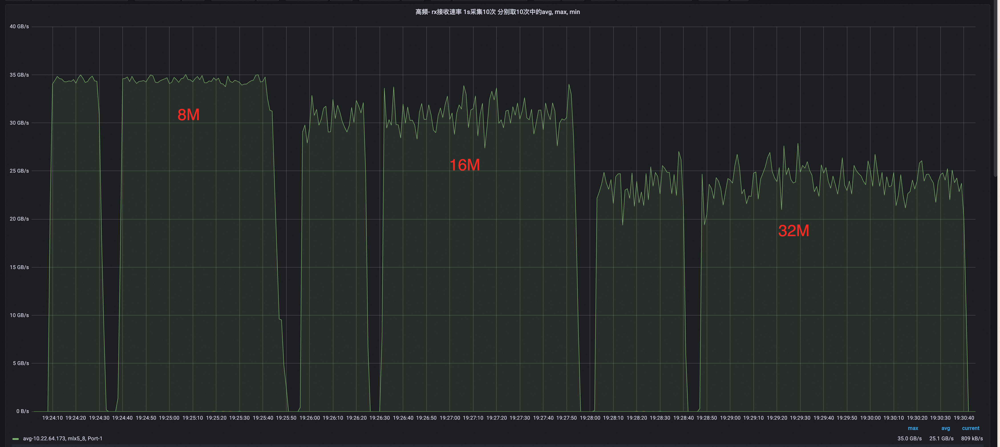
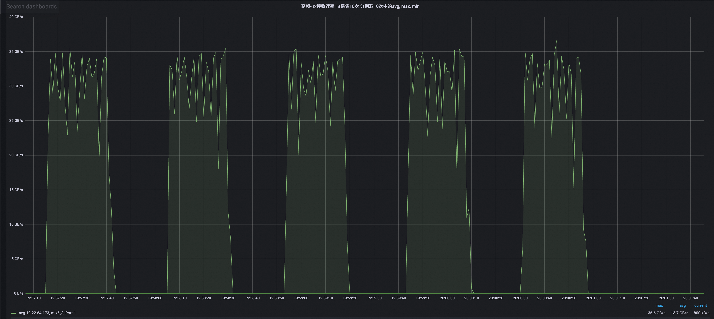

# fastsafetensor-3fs-reader

3FS USRBIO file reader for [fastsafetensors](https://github.com/foundation-model-stack/fastsafetensors).

## Why This Project

Loading safetensors model weights from [3FS](https://github.com/deepseek-ai/3FS) presents a dilemma:

- **Standard safetensors loading** reads 3FS via the FUSE mount path, but suffers from random reads and redundant memory copies, failing to reach the expected throughput.
- **3FS USRBIO SDK** provides high-performance user-space I/O, but its best access pattern -- multi-process, sequential, large-block reads -- cannot be directly consumed by inference frameworks like [SGLang](https://github.com/sgl-project/sglang) or [vLLM](https://github.com/vllm-project/vllm).

[fastsafetensors](https://github.com/foundation-model-stack/fastsafetensors) bridges this gap with a **two-stage loading** architecture (see [PR #33](https://github.com/foundation-model-stack/fastsafetensors/pull/33)):

1. **Stage 1 -- File to Device**: copy file data to GPU memory and construct tensors. This stage is bounded by disk/network throughput + PCIe bandwidth.
2. **Stage 2 -- Tensor Broadcasting**: broadcast tensors to other GPUs via collective communication (e.g. NVLink). This stage is bounded by inter-GPU bandwidth.

Since these two stages depend on different hardware resources, they can be **pipelined** -- Stage 2 for the current batch overlaps with Stage 1 for the next batch, fully utilizing both storage and communication bandwidth.

This project implements the `FileReaderInterface` that fastsafetensors expects for Stage 1, backed by the 3FS USRBIO SDK. It turns USRBIO's multi-process sequential large-block reads into the file reader abstraction that fastsafetensors can directly use.

```
┌─────────────────────────────────────────────────────────────────────────────────┐
│  Inference Framework (SGLang / vLLM / ...)                                      │
│    └── fastsafetensors (two-stage loader)               ── fastsafetensors repo │
│          └── fastsafetensor-3fs-reader                  ── this project         │
│                └── 3FS USRBIO SDK (hf3fs_py_usrbio / libhf3fs)  ── 3FS repo     │
│                      └── 3FS Storage Cluster (RDMA)             ── 3FS repo     │
└─────────────────────────────────────────────────────────────────────────────────┘
```

## Architecture



### Extra Memory Overhead

The diagram below illustrates the extra memory overhead introduced by the two-stage loading scheme. Each rank allocates a **CUDA pinned memory** staging buffer whose size equals the `buffer_size` parameter passed when initializing `FileReaderInterface` (e.g. 16 MB), and each GPU reserves **device memory ≈ file size** for the current batch. After Stage 1 loads data into each GPU, **NCCL Broadcast** replicates the full tensors across all GPUs.



## Backends

| Backend | Module | Requirements | Performance |
|---------|--------|-------------|-------------|
| **C++** | `reader_cpp.py` | `libhf3fs_api_shared.so` + CUDA | Best |
| **Python** | `reader_py.py` | `hf3fs_py_usrbio` (+ optional PyTorch for GPU) | Good |
| **Mock** | `mock.py` | None | For testing only |

The package auto-selects the best available backend at import time: **C++ -> Python -> Mock**. Override with `FASTSAFETENSORS_BACKEND=cpp|python|mock` or check the active backend via `get_backend()`.

### C++ Backend

The C++ backend (`reader_cpp.py` + `cpp/usrbio_reader_v2.cpp`) provides the highest throughput:

- **GIL-free**: all I/O and memory copy operations run in C++ without holding the Python GIL.
- **Native USRBIO async I/O**: uses `hf3fs_ior` / `hf3fs_iov` directly for zero-copy reads from 3FS shared memory.
- **Pipelined mode**: double-buffered async H2D copy via `cudaMemcpyAsync` -- overlaps network I/O with GPU memory transfer. Enable with `pipelined=True` in `read_chunked()`.
- **CUDA pinned memory**: the USRBIO shared-memory buffer is registered as CUDA pinned memory (`cudaHostRegister`) for faster DMA transfers.

### Python Backend

The Python backend (`reader_py.py`) is a pure-Python implementation:

- Uses `hf3fs_fuse.io` (USRBIO Client API) for I/O when available, falls back to `os.pread` otherwise.
- Supports GPU memory transfer via PyTorch (`cudaMemcpy`), with optional CUDA host-pinned staging buffer.
- Does **not** support pipelined mode (silently falls back to non-pipelined).
- Good for environments where C++ compilation is not feasible.

### Mock Backend

The Mock backend (`mock.py`) reads from the local filesystem using standard `os.pread`:

- No 3FS, CUDA, or external dependencies required.
- Designed for CI testing and development.

## Installation

### Prerequisites

Both the C++ and Python backends require the **3FS wheel** (`hf3fs_py_usrbio`) to be installed. This package is **not** available on PyPI and must be built from the [DeepSeek 3FS](https://github.com/deepseek-ai/3FS) source tree.

> For a step-by-step guide on building and installing 3FS (including `hf3fs_py_usrbio`), see the [SGLang 3FS integration documentation](https://github.com/sgl-project/sglang/blob/main/python/sglang/srt/mem_cache/storage/hf3fs/docs/README.md).

### Install fastsafetensor-3fs-reader

**Pure-Python mode** (skip C++ compilation):

```bash
FST3FS_NO_EXT=1 pip install .
```

**With C++ extension** (requires `libhf3fs_api_shared.so` + CUDA Runtime):

```bash
export HF3FS_LIB_DIR=/path/to/3FS/build/lib    # directory containing libhf3fs_api_shared.so
pip install .
```

The `hf3fs_usrbio.h` header is bundled in the package, so no external header dependency is needed.

### Automatic `libhf3fs_api_shared.so` Discovery

At import time, the package automatically searches for `libhf3fs_api_shared.so` using the following priority:

1. **`HF3FS_LIB_DIR`** environment variable (highest priority).
2. **`LD_LIBRARY_PATH`** directories.
3. **`hf3fs_py_usrbio` pip install path** -- if installed via pip, the library is typically in a sibling `.libs/` directory (e.g. `site-packages/hf3fs_py_usrbio.libs/`), discovered automatically.

The library is pre-loaded with `RTLD_GLOBAL` so both backends can resolve its symbols. Check which path was loaded:

```python
from fastsafetensor_3fs_reader import get_hf3fs_lib_path
print(get_hf3fs_lib_path())
```

## Quick Start

```python
from fastsafetensor_3fs_reader import (
    ThreeFSFileReader,
    MockFileReader,
    is_available,
    get_backend,
)

# Check which backend is active
print(f"Backend: {get_backend()}")  # "cpp", "python", or "mock"

# Use 3FS reader when available
if is_available():
    reader = ThreeFSFileReader(mount_point="/mnt/3fs")

    # Stage 1a: read headers (optional: caches fds to avoid re-open/re-fetch on network storage)
    headers = reader.read_headers_batch([
        "/mnt/3fs/model-00001.safetensors",
        "/mnt/3fs/model-00002.safetensors",
    ])

    # Stage 1b: read tensor data into GPU memory
    import torch
    buf = torch.empty(1024 * 1024, dtype=torch.uint8, device="cuda")
    bytes_read = reader.read_chunked(
        path="/mnt/3fs/model-00001.safetensors",
        dev_ptr=buf.data_ptr(),
        file_offset=0,
        total_length=1024 * 1024,
    )
    reader.close()
```

## Performance

> **Test environment:** Single 400 Gbps RDMA NIC, DeepSeek-R1 (~640 GB safetensors).

| Configuration | Avg Throughput (GB/s) | Peak with fastsafetensors (GB/s) | Load Time (s) | Backend |
|---|---|---|---|---|
| 8 processes, buffer=8 MB | 35.0 | 32.0 | 30.34 | C++ (non-pipelined) |
| 8 processes, buffer=16 MB | 37.6 | 36.6 | 25.73 | C++ (pipelined) |

RDMA throughput across buffer sizes 

Model weight loading with fastsafetensors (pipelined, peak 36.6 GB/s 

For the full benchmarking suite (sweep backends, buffer sizes, chunk sizes, process counts), see [`hack/benchmark/`](hack/benchmark/).

## License

Apache-2.0
